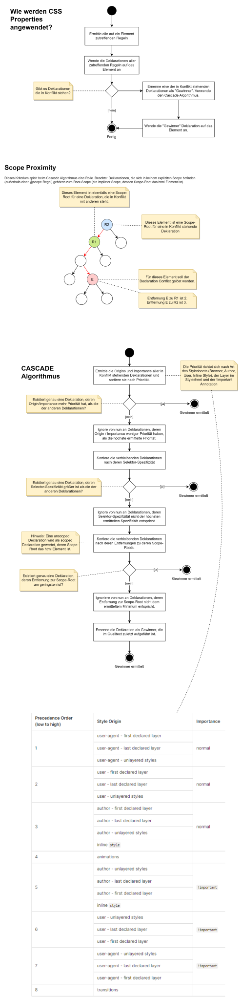

# Setting up the development environment

## Install Windows Terminal App (not Preview)

Use the Windows Store to install this app.

## Install Version Control System Git using the command line
   
```powershell
winget install Git.Git
```

## Clone frontend-development repository

If you work on the host use path `T:\schenker\frontend-development.git`.

If you want to work in a virtual machine follow these steps instead:
- create an internal switch in hyper-v manager (this creates a virtual ethernet adapter on the host)
- add a virtual ethernet adapter to your virtual machine and connect it to the internal switch
- set static ip address of virtual ethernet adapter on host: `192.168.0.10`
- in the virtual machine set static ip address of ethernet adapter: `192.168.0.11`
- ensure that remote desktop connections are allowed in the virtual machine
   (in windows settings -> enable remote desktop connections)
- create remote desktop connection from host to virtual machine using ip `192.168.0.11`
- share drive T (Datenaustausch) with virtual machine in the remote desktop connection settings
- Clone the repository using the path \\tsclient\T\schenker\frontend-development.git

Create the file `.gitconfig` in your home directory. Add the following lines to the file:

```
[user]
   name = Your name 
   email = Your email address
```

**IMPORTANT:** Don't work in the cloned repository! It's only used to share data with the students! Create your own directory for work.
          
## Install Visual Studio Code (not Visual Studio!)

Either download it on the web or use `winget install Microsoft.VisualStudioCode`.

Install the `Live Server` Extension for Visual Studio Code.

## When new content is uploaded to the repository, you can download it using the command git pull.

Ensure you are in the `frontend-development` directory when you execute `git pull`.

## Create a Windows Batch file to update the repository (for convenience)

Create a new text file `update.bat` on your desktop with the following content:

```powershell
@echo off
cd .\frontend-development
git pull
pause
```

# Useful reference and documentation

- [DevDocs](https://devdocs.io/)
   - Provides a central place to access information from many reference sources.
   - Note: Enable the additional reference sources for _React_ and _Boostrap_.
- [MDN](https://developer.mozilla.org/)
- [W3Schools](https://www.w3schools.com/)


# Frontend und Backend


Das Frontend bildet die Schnittstelle zum Benutzer. Der Benutzer kann im Frontend Aktionen ausführen, Daten eingeben und sich anzeigen lassen. Die Verarbeitungslogik steckt jedoch im sogenannten Backend.

Das Backend besteht aus einem oder mehreren Servern. In der Regel enthält das Backend einen Webserver und einen Datenbankserver. Weitere Dienste wie Identitätsmanagement und Authorisierung können ebenfalls vom Backend angesprochen werden.

Frontend und Backend kommunizieren über das HTTP-Protokoll. Ein Frontend kommuniziert nicht direkt mit der Datenbank, sondern schickt lediglich eine Anfrage an das Backend. Das Backend wird dann alle notwendigen Maßnahmen treffen, um die Daten aus der Datenbank zu lesen.

Backends können mit zahlreichen Programmiersprachen und Frameworks entwickelt werden. Ein paar Beispiele:

- C# und ASP.NET Framework
- Java mit Java Enterprise Edition (Jakarta)
- JavaScript / TypeScript in Kombination mit Node.js
- PHP mit Laravel

Frontends werden meist mit JavaScript bzw. TypeScript entwickelt. Sofern die WebAssembly Technologie in Zukunft von allen modernen Browsern vollständig unterstützt wird, lassen sich Frontends dann auch in beliebigen Programmiersprachen entwickeln. Ein paar Beispiele für Frontend Frameworks:

- Angular
- Next.js
- React (eher eine UI Library)
- Vue.js

# Client-Side-Rendering und Server-Side-Rendering

Beim Client-Side-Rendering (CSR) wird das HTML Dokument dynamisch "gefüllt". Der Server sendet lediglich ein fast leeres HTML Dokument inklusive der Anwendung als gebündelte JavaScript Datei (`app.js`) an den Client. Der Client holt sich im Anschluss Daten vom Server und generiert daraus neue Elemente im HTML Dokument. In der Regel werden JSON Dokumente zwischen Client und Server ausgetauscht. Beispiel: Die React Library verwendet standardmäßig CSR, kann aber auch im SSR Modus betrieben werden.

Beim Server-Side-Rendering (SSR) schickt der Server i.d.R. ein vollständiges HTML Dokument an den Client. Der Client muss hier lediglich das Dokument anzeigen, aber nicht selbst ergänzen bzw. füllen. Bei Anfragen vom Client werden komplett neue HTML Fragmente vom Server erzeugt und an den Client zurückgeschickt. Beispiel: Eine klassische PHP Anwendung rendert das gesamte Dokument auf der Serverseite und schickt das Ergebnis an den Client zurück.

# CSS Terminologie


# CSS Box Model

Wenn HTML Elemente visualisiert werden, entstehen eine Reihe sogenannter _Boxes_. Eine _Box_ enthält weitere geschachtelte Boxen:

- Content-Box: Der Inhalt des Elements.
- Padding-Box: Inhalt inklusive Innenabstand zum Rahmen.
- Border-Box: Inhalt, Innenabstand und der Rahmen selbst. 
   - Hintergrundfarbe wird auf diese Box angewendet.
   - Rahmen kann zusätzlich mit anderer Farbe gezeichnet werden.
   - Definiert die gerenderte Größe des dargestellten Elements.
- Margin-Box: Definiert Außenabstand zu anderen Boxen. 
   - Wird immer transparent dargestellt.


## Screenshot der Dev-Tools des Browsers

Die Dev-Tools zeigen die oben genannten geschachtelten Boxen an.


# Unterschiede zwischen Block-Level Box und Inline-Level Box


Eine Block-Level Box wird in ihre eigene Zeile gesetzt. Inline-Level Boxen werden horizontal in einer Linie angeordnet und ggf. auf die nächste Zeile umgebrochen.

Block-Level-Boxen verwenden standardmäßig die Breite ihres Elterncontainers. Inline-Level-Boxen verwenden nur die absolut notwendige Breite.

Vertikaler Margin wird bei Block-Level-Boxen zusammengelegt (collapse). Margin hat bei Inline-Level-Boxen keinen Effekt.

Horizontaler Margin wird sowohl von Block-Level-Boxen als auch Inline-Level-Boxen berücksichtigt, aber nicht zusammengelegt (collapse).

Vertikaler Padding wird bei Inline-Level-Boxen zwar berücksichtigt, allerdings hat dies keinen Effekt auf das Layout.

**Hinweis**: Für jedes Element kann sowohl ein _Outer Display Type_ sowie ein _Inner Display Type_ festgelegt werden.

Beispiele:
- `display: inline block` setzt outer display type auf _inline_ aber der innere Display Type ist _block_.
- `display: flex` setzt outer display type auf _block_ aber inner display type ist _flex_.


# CSS Cascade

Die CSS Cascade ist ein Algorithmus der festlegt, welche der miteinander in Konflikt stehenden Deklarationen schlussendlich auf ein Element angewendet wird.

Die CSS Cascade verwendet für die Entscheidung folgende Kriterien:

- Origin / Kind of Stylesheet / Importance / Layer: 
   - User-Agent Stylesheets
   - User Stylesheets (werden von Browser Endnutzern verwendet, um z.B. visuelle Beeinträchtigungen zu kompensieren)
   - Author Stylesheets (die des Entwicklers)
- Inline Style oder nicht: Steht die Deklaration in einem Inline Style oder ist sie Bestandteil einer Regel in einem Stylesheet?
- Specificity: Die Spezifizität des Selektors in dem sich die Deklaration befindet.
- Source Order: Die Anordnung der Regeln im Stylesheet
- CSS Layer: In welchem Layer des Stylesheets befindet sich die Deklaration? 
- Scope: In welchem Scope befindet sich die Deklaration. Ein Scope bezieht sich nur auf einen Teil des HTML Dokuments.

Hier folgt der detaillierte Algorithmus:



## Die Spezifizität eines Selectors

Die Spezifizität setzt sich aus 3 Komponenten zusammen, wobei die erste Komponente den höchsten Stellenwert besitzt und die dritte Komponente den niedrigsten Stellenwert.

Um zwei Spezifizitäten zu vergleichen, führe einen schrittweisen Komponentenvergleich durch. Vergleiche zuerst die ersten Komponenten. Falls diese gleich sind, vergleiche die zweiten Komponenten und falls diese auch gleich sind die dritten Komponenten miteinander. Sobald bei einem Vergleich eine Komponente größer ist als die andere, steht fest, welche Spezifizität größer ist.

Tipp: Stell dir die Spezifizität wie eine Programmversion vor. Die erste Komponente ist die Major-Version, die zweite Komponente ist die Minor-Version und die dritte Komponente ist die Patch-Version.

Beispiele:

```
(1, 0, 12) > (1, 0,  0)
(0, 1,  0) > (0, 0, 12)
```

## Wie entstehen die Werte für die einzelnen Komponenten? 

Hierzu werden alle Teilselektoren eines Selektors betrachtet und deren Wertigkeiten aufaddiert. 
- ID Selektoren haben die Wertigkeit (1, 0, 0). 
- Class-Selectors haben die Wertigkeit (0, 1, 0) 
- Pseudo-Classes haben ebenfalls Wertigkeit (0, 1, 0)
- Element-Selectors und Pseudo-Element Selectors haben die Wertigkeit (0, 0, 1). 
- Der Universalselector hat Wertigkeit (0, 0, 0).

Combinators tragen nicht zur Spezifizität bei.

Beispiel:

```css
div.wrapper.block-level > a p {}
```

Der Selektor hat die Wertigkeit (0, 2, 3), denn es gibt 3 Elementselektoren (div, a, p) und 2 Class-Selectors (.wrapper und .block-level). Der Combinator `>` spielt keine Rolle.
 